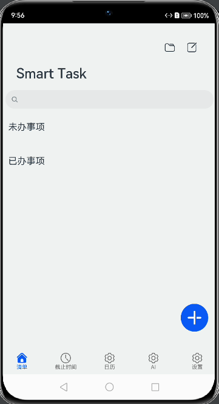
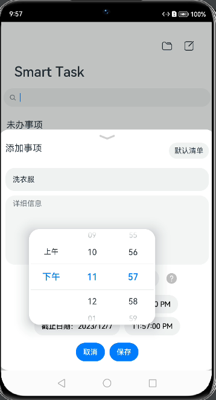
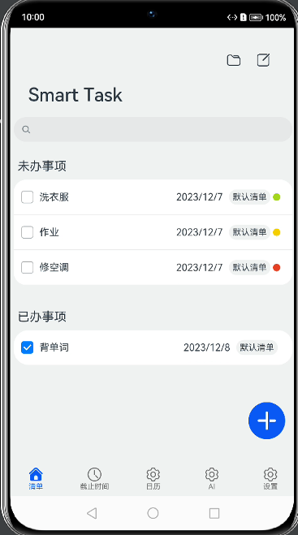
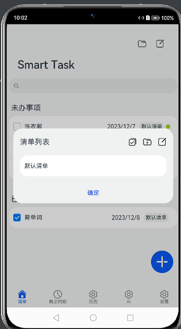
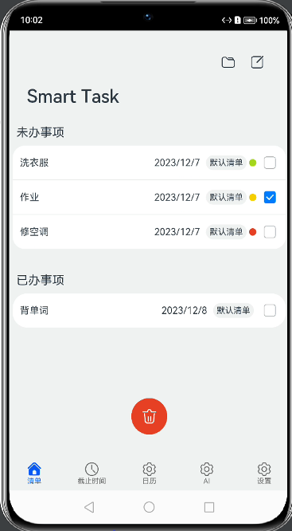
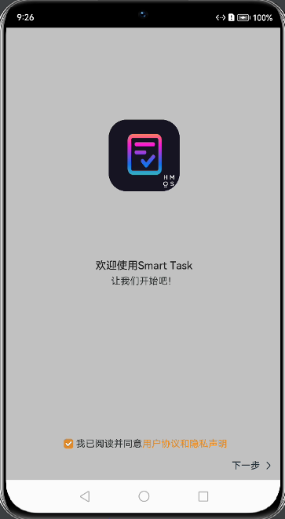
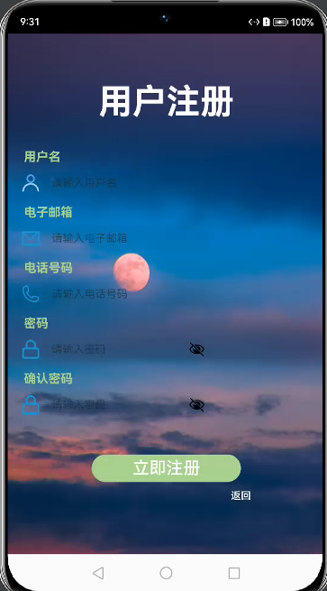
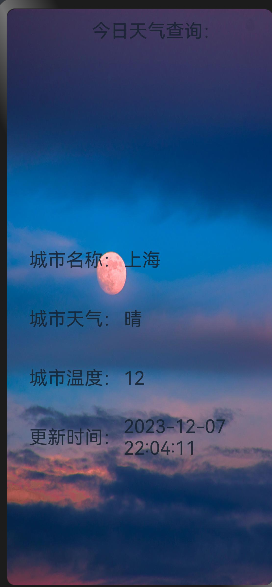
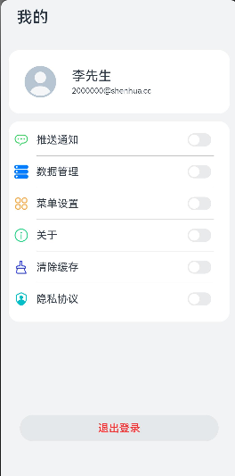

SmartTask智能待办系统

[TOC]

## 一.项目功能图

### 1.1 创建待办事项



- 单击右下角的+号，即可创建新的待办

### 1.2 设置截止时间



- 在创建待办页面，截止时间可通过滑动更改

### 1.3 完成待办事项



- 单击待办事项前的方框，即可标记待办事项已完成

### 1.4 截止时间查询


- 在截止时间页，可查看待办紧急情况。

### 1.5 创建清单文件夹



- 单击右上角的文件图表，即可新建文件夹，进行待办分类

### 1.6 删除待办事项



- 单击右上角编辑按钮，即可进行待办事项删除。

## 二.项目简介

- ### 2.1 项目说明

  SmartTask智能待办系统是一款旨在提高任务管理效率的系统，目前只具备初步功能，后续将通过集成AI问答、语音识别、ModelArts、数据库和HarmonyOS等技术，帮助用户更有效地管理任务。该系统针对现代生活中常见的诸如忘记任务、时间管理不佳等问题，提供了诸如减轻大脑负担、提高工作效率、个性化任务管理、时间规划和生态系统增强等功能。项目还探讨了市场情况、创新点、设计理念以及系统的应用前景，旨在与HarmonyOS集成，为生态系统提供有价值的工具。

- ### 2.2 项目初步设计流程图

  


## 三.项目界面介绍

### 3.1 welcomepage1



- 在打开应用时，会进入如下页面。

### 3.2 loginPage


### 3.3 registerPage



### 3.4 weatherPage



### 3.5 settingPage



### 3.6 homePage


## 四.开发指导

### 4.1 IndexTabPages

#### 4.1.1 TaskList

```Arkts
import TaskTable from '../../common/database/TaskTable'
import {TaskListItemData} from '../../common/bean/TaskListItemData'
import Logger from '../../common/utils/Logger'
import { TaskItemDialog } from '../view/TaskItemDialog'
import { TaskItemDialog_ViewOnly } from '../view/TaskItemDialog_ViewOnly'
import promptAction from '@ohos.promptAction';
import CommonConstants from '../../common/constants/CommonConsts'
import CommonUI from '../../common/constants/CommonUIConstants'
import PreferenceData from '../../common/bean/PreferenceData'
import TaskCategoryData from '../../common/bean/TaskCategoryData'
import NewCategoryDialog from '../view/NewCategoryDialog'
import CategoryTable from '../../common/database/CategoryTable'
import CategoryListDialog from '../view/CategoryListDialog'

@Component

export default struct TaskList {

  @Link taskList: Array<TaskListItemData>
  @Link taskTable: TaskTable
  @Link prefData: PreferenceData
  @Link categoryList: TaskCategoryData[]
  @Link categoryTable: CategoryTable
  @State isEditing: boolean = false
  @State dialogIsAddNew: boolean = true
  @State taskItem: TaskListItemData = new TaskListItemData()
  private dialogSelectedIndex: number = -1
  private deleteTarget: Array<TaskListItemData> = []

  // UI 编辑弹窗 Dialog
  dialogController: CustomDialogController = new CustomDialogController({
    builder: TaskItemDialog({
      dialogIsAddNew: $dialogIsAddNew,
      taskItem: $taskItem,
      confirm: (dialogIsAddNew: boolean, taskItem: TaskListItemData) => {
        if (dialogIsAddNew) {
          this.submitNewTask(taskItem)
        } else {
          this.updateExistingTask(taskItem)
        }
        dialogIsAddNew = true
      },
      prefData: $prefData,
      categoryList: $categoryList
    }),
    alignment: DialogAlignment.Bottom,
    customStyle: true
  })
  dialogController_view: CustomDialogController = new CustomDialogController({
    builder: TaskItemDialog_ViewOnly({
      taskItem: $taskItem,
      categoryList: $categoryList
    }),
    alignment: DialogAlignment.Bottom,
    customStyle: true
  })
  dialogCategoryList: CustomDialogController = new CustomDialogController({
    builder: CategoryListDialog({
      categoryList: $categoryList,
      categoryTable: $categoryTable,
      safeDeleteCheckID: (id) => {
        for (let i = 0; i < this.taskList.length; ++i) {
          if (this.taskList[i].category == id) return false;
        }
        return true
      },
      openNewCategoryDialog: () => {
        this.dialogNewCategory.open()
      },
      queryCategory: (id) => {
        this.queryCategory(id)
      }
    })
  })
  dialogNewCategory: CustomDialogController = new CustomDialogController({
    builder: NewCategoryDialog({
      confirm: (newCategory: TaskCategoryData) => {
        this.categoryTable.insertData(newCategory, (id) => {
          newCategory.id = id;
          this.categoryList.push(newCategory)
          Logger.debug(`Category Added. Now: ${JSON.stringify(this.categoryList)}`)
        })
      }
    }),
  })


  @Builder TaskList_ListItem(item: TaskListItemData, index: number) {
    Row() {
      if (!this.isEditing) {
        Checkbox()
          .select(item.is_completed)
          .onChange((value: boolean) => {
            animateTo({duration: 300, curve: Curve.EaseInOut}, () => {
              item.is_completed = value
              this.dialogSelectedIndex = index
              this.updateExistingTask(item)
            })
          })
          .margin({ right: 10 })
      }
      Text(item.task_name)
        .textOverflow({overflow: TextOverflow.Ellipsis })
        .maxLines(1)
        .width('40%')
      Blank()
        .layoutWeight(1)
      Row() {
        Text(getTimeString(item.due_date_stamp))
          .margin({right: 10})

        Button() {
          Text(item.categoryName)
            .fontSize(14)
        }.backgroundColor('#f1f2f3')
        .margin({right: 4})
        .padding({left: 6, right: 6, top: 4, bottom: 4})
        if (!item.is_completed)
          Button({type: ButtonType.Circle, }) {
            Text(' ')
          }
          .backgroundColor(CommonConstants.DDL_COLOR[item.getDDLState()])
          .height(12)
          .width(12)
      }.margin({right: 8})
      if (this.isEditing) {
        Toggle({ type: ToggleType.Checkbox, isOn: false })
          .onChange((isOn: Boolean) => {
            if (isOn) this.deleteTarget.push(item)
            else {
              let this_id_index = this.deleteTarget.indexOf(item)
              this.deleteTarget.splice(this_id_index, 1)
            }
          })
      }
    }.justifyContent(FlexAlign.SpaceBetween)
    .height(56)
    .width('100%')
    .padding({ left: 12, right: 12 })
    .backgroundColor(item.topped ? '#80B6C5D1' : '#ffffff')
    .gesture(
      LongPressGesture()
        .onAction(() => {
          Logger.debug(`Drag Start`)
          item.topped = !item.topped
          this.dialogSelectedIndex = index
          this.updateExistingTask(item)
        })
    )
  }

  sortItems() {
    this.taskList.sort((a, b) => {
      return Number(b.topped == true ? 2 : 0) - Number(a.topped == true ? 2 : 0)
    })
  }

  // 数据库操作封装
  submitNewTask(taskData: TaskListItemData) {
    this.taskTable.insertData(taskData, (id: number) => {
      taskData.id = id
      taskData.setAll(this.categoryList)
      this.taskList.push(taskData)
    })
  }
  updateExistingTask(taskData: TaskListItemData) {
    this.taskTable.updateData(taskData, () => {})
    taskData.setAll(this.categoryList)
    let new_task = this.taskList
    this.taskList = new Array<TaskListItemData>()
    new_task[this.dialogSelectedIndex] = taskData
    new_task.sort((a, b) => {
      return Number(b.topped == true ? 2 : 0) - Number(a.topped == true ? 2 : 0)
    })
    new_task.forEach((val) => {
      this.taskList.push((val))
    })
    this.dialogSelectedIndex = -1
  }
  deleteSelectedTasks() {
    if (this.deleteTarget.length == 0) return;
    for (let i = 0; i < this.deleteTarget.length; ++i) {
      let target = this.deleteTarget[i]
      this.taskTable.deleteData(target, (ret) => {
        if (ret) {
          let targetIndex = this.taskList.indexOf(target)
          this.taskList.splice(targetIndex, 1)
        }
      })
    }
    this.deleteTarget = []
  }
  querySearchTask(searchVal: string, callback?: Function) {
    // 暂时只写了task_name
    this.taskTable.queryTaskName(`%${searchVal}%`, (searchRes: TaskListItemData[]) => {
      this.taskList = new Array<TaskListItemData>()
      searchRes.sort((a, b) => {
        return Number(b.topped == true ? 2 : 0) - Number(a.topped == true ? 2 : 0)
      })
      searchRes.forEach(item => {this.taskList.push(item)})
      for (let i = 0; i < this.taskList.length; ++i) {
        this.taskList[i].setAll(this.categoryList)
      }
      Logger.debug(`TaskListItemData = ${JSON.stringify(this.taskList)}`)
      if (callback !== undefined) callback()
    }, (searchVal == ''))
  }
  queryCategory(searchVal: number, callback?: Function) {
    let tmp: TaskListItemData = new TaskListItemData()
    tmp.category = searchVal
    this.taskTable.basic_query('category', tmp, (searchRes: TaskListItemData[]) => {
      this.taskList = new Array<TaskListItemData>()
      searchRes.sort((a, b) => {
        return Number(b.topped == true ? 2 : 0) - Number(a.topped == true ? 2 : 0)
      })
      searchRes.forEach(item => {this.taskList.push(item)})
      for (let i = 0; i < this.taskList.length; ++i) {
        this.taskList[i].setAll(this.categoryList)
      }
      Logger.debug(`TaskListItemData = ${JSON.stringify(this.taskList)}`)
      if (callback !== undefined) callback()
    }, (searchVal == 0))
  }
  // 数据库操作封装 结束

  // UI
  build() {
    Stack({alignContent: Alignment.Bottom}) {
      Stack({ alignContent: (this.isEditing ? Alignment.Bottom : Alignment.BottomEnd) }) { // 主界面与悬浮按钮叠放
        Navigation() { // UI 标题栏
          // UI 搜索
          if (!this.isEditing)
            Search()
              .onSubmit((value: string) => {
                this.querySearchTask(value)
              })

          Column() {
            Column() {
              // UI 待办事项界面
              // issue: 不满一屏仍然滚动
              Scroll() {
                Column() {
                  // UI 待办事项列表
                  Text('未办事项')
                    .textTitle()

                  List() {
                    // 未办事项
                    ForEach(this.taskList, (item: TaskListItemData, index) => {
                      if (!item.is_completed) ListItem() {
                        this.TaskList_ListItem(item, index)
                      }.width('100%')
                      .backgroundColor(0xffffff)
                      .onClick(() => {
                        if (this.isEditing) {
                          this.taskItem = item
                          this.dialogIsAddNew = false
                          this.dialogSelectedIndex = this.taskList.indexOf(item)
                          this.dialogController.open()
                        } else {
                          this.taskItem = item
                          this.dialogController_view.open()
                        }
                      })
                    })
                  }
                  .width('100%')
                  .borderRadius(20)
                  .divider({ strokeWidth: 1 })
                  .margin({ bottom: 20 })


                  Text('已办事项')
                    .textTitle()

                  List() {
                    // 已办事项
                    ForEach(this.taskList, (item: TaskListItemData, index) => {
                      if (item.is_completed) ListItem() {
                        this.TaskList_ListItem(item, index)
                      }.width('100%')
                      .backgroundColor(0xffffff)
                      .onClick(() => {
                        if (this.isEditing) {
                          this.taskItem = item
                          this.dialogIsAddNew = false
                          this.dialogSelectedIndex = this.taskList.indexOf(item)
                          this.dialogController.open()
                        } else {
                          this.taskItem = item
                          this.dialogController_view.open()
                        }
                      })
                    })
                  }
                  .width('100%')
                  .borderRadius(24)
                  .divider({ strokeWidth: 1 })
                  .margin({bottom: 40})
                }
                // .justifyContent(FlexAlign.Start)
                .margin({top: 0})
              }
              .edgeEffect(EdgeEffect.Spring)
              .scrollBar(BarState.Off)
            }
          }.height('100%')
        }.titleMode(NavigationTitleMode.Full)
        .title('Smart Task')
        .menus([{
          value: "",
          icon: '../../../resources/base/media/ic_public_folder.svg',
          action: () => {
            this.dialogCategoryList.open()
          }
        },{
            value: "",
            icon: (this.isEditing ? '../../../resources/base/media/ic_public_edit_filled.svg' : '../../../resources/base/media/ic_public_edit.svg'),
            action: () => {
              animateTo({duration: 200, curve: Curve.EaseOut}, () => {
                this.deleteTarget = []
                this.isEditing = !this.isEditing
              })
            }
          }])
        .height('100%')
        .mode(NavigationMode.Stack)

        // UI 右下角的 Fab
        Button({ type: ButtonType.Circle }) {
          if (!this.isEditing) Image($r('app.media.ic_public_list_add_light'))
          else {
            Image($r('app.media.ic_public_delete'))
              .height(28)
              .width(28)
          }
        }
        .backgroundColor(!this.isEditing ? 0x0A59F7 : 0xE84026)
        .width(60)
        .height(60)
        .margin({ bottom: 12, right: (this.isEditing ? 0 : 12) })
        .onClick(() => {
          animateTo({duration: 200, curve: Curve.EaseOut}, () => {
            if (!this.isEditing) {
              this.dialogIsAddNew = true
              this.taskItem = new TaskListItemData()
              this.dialogController.open()
            } else {
              if (this.deleteTarget.length != 0) {
                this.deleteSelectedTasks()
                this.isEditing = false
              }
            }
          })
        })
      }.padding(CommonUI.DEFAULT_PADDING)
      // UI <临时> 提交入口（只剩刷新按钮了）
      // if (!this.isEditing) Column() {
      //   Row() {
      //     Button('刷新')
      //       .onClick(() => {
      //         promptAction.showToast({message: '刷新中'})
      //         this.querySearchTask('', () => {
      //           promptAction.showToast({message: '刷新成功'})
      //         })
      //       })
      //   }.justifyContent(FlexAlign.SpaceAround)
      //   .margin({ top: 30 })
      // }.padding({ left: 12, right: 12, bottom: 30 })
    }
  }
}

@Extend(Text) function textTitle() {
  .fontSize(20)
  .width('100%')
  .margin({ left: 12, bottom: 10, top: 20 })
  .textAlign(TextAlign.Start)
}

function getTimeString(date_stamp: number): string {
  let date: Date = new Date()
  date.setTime(date_stamp)
  Logger.debug(`TaskList: datestamp = ${date_stamp}, date = ${date.toLocaleDateString()}`)
  let ds: string[] = date.toLocaleDateString().split('/')
  let res: string = `${ds[2]}/${ds[0]}/${ds[1]}`
  return res
}
```

- 组件定义(@Component)：介绍如何定义一个组件及其用途。例如，@Component标记表明这是一个Vue组件。

- 数据结构(TaskList结构体)：TaskList结构体的成员变量和其功能。如taskList存储任务项，isEditing表示是否处于编辑模式。

- UI弹窗定义：创建编辑任务对话框的方法，包括只读视图和分类列表对话框。例如，TaskItemDialog用于编辑任务，而CategoryListDialog用于管理任务分类。

- TaskList_ListItem方法：构建任务列表的每一项，包括处理用户交互的细节。

- 数据库操作方法：实现增加、更新、删除任务的功能。例如，submitNewTask用于添加新任务，updateExistingTask用于更新现有任务。

- UI构建(build方法)：UI的布局以及整合各个组件和功能。例如，如何使用Navigation和Button来创建导航栏和按钮。

- 辅助方法：辅助方法的作用，如textTitle用于设置文本样式，getTimeString用于将时间戳转换为可读格式。

#### 4.1.2 DDLState

```Arkts
import TaskTable from '../../common/database/TaskTable'
import { TaskListItemData } from '../../common/bean/TaskListItemData'
import Logger from '../../common/utils/Logger'
import { TaskItemDialog_ViewOnly } from '../view/TaskItemDialog_ViewOnly'
import promptAction from '@ohos.promptAction';
import CommonConstants from '../../common/constants/CommonConsts'
import TaskCategoryData from '../../common/bean/TaskCategoryData'

@Component

export default struct DDLState {
  @Link tasks: Array<TaskListItemData>
  @Link categoryList: TaskCategoryData[]
  @State isEditing: boolean = false
  @State dialogIsAddNew: boolean = true
  @State taskItem: TaskListItemData = new TaskListItemData()
  private taskTable: TaskTable = new TaskTable(() => {});
  private dialogSelectedIndex: number = -1

  dialogController_view: CustomDialogController = new CustomDialogController({
    builder: TaskItemDialog_ViewOnly({
      taskItem: $taskItem,
      categoryList: $categoryList
    }),
    alignment: DialogAlignment.Bottom,
    customStyle: true
  })

  @Builder TaskList_ListItem(item: TaskListItemData) {
    Column() {
      Row() {
        Row() {
          if (!this.isEditing) {
            Checkbox()
              .select(item.is_completed)
              .onChange((value: boolean) => {
                animateTo({duration: 300, curve: Curve.EaseInOut}, () => {
                  item.is_completed = value
                  this.updateExistingTask(item)
                })
              })
              .margin({ right: 10 })
          }
          Text(item.task_name)
            .textOverflow({ overflow: TextOverflow.Ellipsis })
            .maxLines(1)
            .width('60%')
        }
        Row() {
          Column() {
            Text(getDateString(item.due_date_stamp))
              .fontSize(16)
            Text(getTimeString(item.due_date_stamp))
              .fontSize(13)
          }.alignItems(HorizontalAlign.End)
          .margin({ right: 10 })

          if (!item.is_completed) Button({ type: ButtonType.Circle, }) {
            Text(' ')
          }
          .backgroundColor(CommonConstants.DDL_COLOR[item.getDDLState()])
          .height(12)
          .width(12)
        }
        // Blank()
        //   .layoutWeight(1)
        // Text(item.subject.toString())
      }.justifyContent(FlexAlign.SpaceBetween)
      .height(56)
      .width('100%')
      .padding({ left: 12, right: 12 })

      Progress({value: 100 - item.getDDLPer()})
        .margin({bottom: 10})
        .color(CommonConstants.DDL_COLOR[item.getDDLState()])
    }
  }

  @Builder TaskList_DDLState(text: string, state: string) {
    Text(text)
      .fontSize(20)
      .width('100%')
      .margin({ bottom: 10, top: 20})
      .textAlign(TextAlign.Start)
      .padding({ left: 12, right: 12 })

    List() {
      // 未办事项
      ForEach(this.tasks, (item: TaskListItemData) => {
        if (!item.is_completed && item.getDDLState() == state) ListItem() {
          this.TaskList_ListItem(item)
        }.width('100%')
        .backgroundColor(0xffffff)
        .onClick(() => {
          this.taskItem = item
          this.dialogController_view.open()
        })
      })
    }
    .width('100%')
    .borderRadius(20)
    .divider({ strokeWidth: 1 })
    .margin({ bottom: 20 })
  }

  updateExistingTask(taskData: TaskListItemData) {
    this.taskTable.updateData(taskData, () => {})
    let new_task = this.tasks
    this.tasks = []
    new_task[this.dialogSelectedIndex] = taskData
    // Logger.debug(`TaskList taskData = ${JSON.stringify(taskData)}`)
    this.tasks = new_task // 触发 UI 刷新
    this.dialogSelectedIndex = -1
  }
  querySearchTask(searchVal: string, callback?: Function) {
    // 暂时只写了task_name
    this.taskTable.queryTaskName(`%${searchVal}%`, (searchRes) => {
      this.tasks = []
      searchRes.forEach(item => {this.tasks.push(item)})
      for (let i = 0; i < this.tasks.length; ++i) {
        this.tasks[i].setAll(this.categoryList)
      }
      if(callback !== undefined) callback()
    }, (searchVal == ''))
  }
  // 数据库操作封装 结束

  // UI
  build() {
    Column() {
      Stack({alignContent: Alignment.Bottom}) {
        Navigation() { // UI 标题栏
          // UI 搜索

          if (!this.isEditing) Search()
            // .onClick(() => { this.isOnSearch = true})
            .onSubmit((value: string) => {
              this.querySearchTask(value)
            })
              // .padding({ left: 12, right: 12 })
            .width('90%')

          Column() {
            // UI 待办事项界面
            Scroll() {
              Column() {
                // UI 待办事项列表
                this.TaskList_DDLState('非常紧急', 'critical')
                this.TaskList_DDLState('紧急', 'hard')
                this.TaskList_DDLState('还有时间', 'medium')
                this.TaskList_DDLState('该开始了', 'easy')
              }
              .padding({ left: 12, right: 12, bottom: 10, top: 10 })
              .margin({bottom: 40})
              // .height('70%')
              .justifyContent(FlexAlign.Start)
            }.edgeEffect(EdgeEffect.Spring)
            .scrollBar(BarState.Off)
          }
          .justifyContent(FlexAlign.SpaceBetween)
        }
        .height('100%')
        .width('100%')
        .titleMode(NavigationTitleMode.Mini)
        .hideBackButton(true)
        .mode(NavigationMode.Stack)
        .title('截止时间')

        // UI <临时> 提交入口（只剩刷新按钮了）
        // if (!this.isEditing) Column() {
        //   Row() {
        //     Button('刷新')
        //       .onClick(() => {
        //         promptAction.showToast({message: '刷新中'})
        //         this.querySearchTask('', () => {
        //           promptAction.showToast({message: '刷新成功'})
        //         })
        //       })
        //   }.justifyContent(FlexAlign.SpaceAround)
        //   // .margin({ top: 30 })
        // }.padding({ left: 12, right: 12, bottom: 30 })
      }.height('100%')
    }.width('100%')
    .height('100%')
  }
}

function getDateString(date_stamp: number): string {
  let date: Date = new Date()
  date.setTime(date_stamp)
  Logger.debug(`TaskList: datestamp = ${date_stamp}, date = ${date.toLocaleDateString()}`)
  let ds: string[] = date.toLocaleDateString().split('/')
  let res: string = `${ds[2]}/${ds[0]}/${ds[1]}`
  return res
}

function getTimeString(date_stamp: number): string {
  let date: Date = new Date()
  date.setTime(date_stamp)
  Logger.debug(`TaskList: datestamp = ${date_stamp}, date = ${date.toLocaleTimeString()}`)
  return date.toLocaleTimeString()
}

```

- 组件和数据结构：DDLState结构体及其成员变量，如tasks、isEditing等。

- UI弹窗定义：使用TaskItemDialog_ViewOnly创建任务项的只读视图对话框。

- TaskList_ListItem方法：构建任务列表的每一项，包括复选框和任务名称的展示。

- updateExistingTask方法：更新任务列表中的现有任务项。

- querySearchTask方法：根据搜索值查询任务项。

- UI构建(build方法)：UI的结构和使用Navigation和Column来布局界面。

- 辅助函数：getDateString和getTimeString函数，用于将时间戳转换为日期和时间字符串。

### 4.2 Pages

#### 4.2.1 loginPage

```Arkts
import router from '@ohos.router'
import prompt from '@ohos.prompt'
@Entry
@Component
struct Loginpage {
  @State message: string = 'Hello World'
  @State user: string = ''
  @State password: string = ''

  login() {
    if (this.user == '' || this.password == '') {
      prompt.showToast({
        message: '用户名和密码不能为空!',
        duration: 2000
      });
    }else{
      if (this.user == 'a' && this.password == '1') {
        prompt.showToast({
          message: '用户名密码输入正确!',
          duration: 2000
        });
        router.replaceUrl({ url: 'pages/Index' });
      }else{
        prompt.showToast({
          message: '请输入正确的用户名和密码!',
          duration: 2000
        });
      }
    }
  }

  build() {
    Column() {
      Column() {
        //   头像
        Image($r("app.media.avatar"))
          .width(100)
          .height(100)
          .margin(100)
          .clip(new Circle({ width: 100, height: 100 }))

        //   用户名输入框
        TextInput({
          placeholder: "请输入用户名",

        })
          .width("70%")
          .backgroundColor("white")
          .onChange((value: string) => {
            this.user = value;
          })
        //   密码输入框
        TextInput({ placeholder: "请输入密码" })
          .width("70%")
          .margin({ top: 20 })
          .type(InputType.Password)
          .backgroundColor("white")
          .onChange((value: string) => {
            this.password = value;
          })

        Row(){
          //    忘记密码
          Button("验证码登录")
            .fontSize(15)
            .margin({left:-5})
            .width("50%")
            .backgroundColor("")
            .onClick(()=>
            router.pushUrl({url:"pages/registerPage"})
            )
          //    忘记密码
          Button("忘记密码？")
            .fontSize(15)
            .margin({left:20})
            .width("50%")
            .backgroundColor("")
            .onClick(()=>
            router.pushUrl({url:"pages/registerPage"})
            )
        }

        .width("360vp")
        .height("68.65vp")
        .offset({ x: "3.93vp", y: "-16.75vp" })

        //   登陆按钮
        Button("登录")
          .fontSize(18)
          .backgroundColor('#0F40F5')
          .type(ButtonType.Capsule)
          .width("50%")
          .margin(10)
          .onClick(() =>{
            this.login()
          }
          )
        Button("注册")
          .fontSize(18)
          .backgroundColor('#0F40F5')
          .type(ButtonType.Capsule)
          .width("50%")
          .margin(10)
          .onClick(() =>{
            this.login()
          }
          )
        Row() {
          Image($r('app.media.huawei'))
            .width("33%")
            .height("100%")
            .objectFit(ImageFit.Contain)
          Image($r("app.media.qq"))
            .width("33%")
            .height("100%")
            .objectFit(ImageFit.Contain)
          Image($r('app.media.weixin'))
            .width("33%")
            .height("100%")
            .objectFit(ImageFit.Contain)
        }
        .width("360vp")
        .height("50vp")
        .offset({ x: "0vp", y: "40vp" })
      }
      .width("100%")
      .height("100%")
      .backgroundImage($r("app.media.wel1"))
      .opacity(0.7)
      .backgroundImageSize(ImageSize.Cover)
      .justifyContent(FlexAlign.Center)
    }
  }
}
```

- 状态变量：user、password和message状态变量，分别用于存储用户输入的用户名、密码和显示的消息。

- login方法：login方法的逻辑，包括验证输入并根据验证结果进行路由跳转或显示提示。

- UI构建(build方法)：构建登录页面的UI，包括头像、用户名密码输入框、登录和注册按钮等。

#### 4.2.2 welcomePages

```Arkts
import device from '@system.device';
import window from '@ohos.window';
import router from '@ohos.router';

PersistentStorage.PersistProp('IsFirstIn', 1)
PersistentStorage.PersistProp('IsAgreed', 0)

@Entry
@Component
struct guide {
  @State statusBarHeight: number = 0
  @State screenDensity: number = 2
  @StorageLink('IsAgreed') IsAgreed: number = 0

  aboutToAppear() {
    // window.getTopWindow((err, data) => {
    //      var windowClass = data;
    //      var type = window.AvoidAreaType.TYPE_SYSTEM;
    //      windowClass.getAvoidArea(type, (err, data) => {
    //        if (err) {
    //          console.error('Failed to obtain the area. Cause:' + JSON.stringify(err));
    //          return;
    //        }
    //        this.statusBarHeight = data.topRect.height;
    //        console.info("statusBarHeight====>>>> %{private}d", this.statusBarHeight);
    //      });
    //    });
    //    var that = this;
    //    device.getInfo({
    //      success: function (data) {
    //        console.info("Device information obtained successfully. Device screenDensity: %{private}d", data.screenDensity);
    //        that.screenDensity = data.screenDensity;
    //      },
    //      fail: function (code) {
    //        console.info("Failed to obtain device information. Error code: %{private}d", code);
    //      },
    // });
  }

  private endGuide() {
    AppStorage.Set('IsFirstIn', 0)
    router.replace({
      url: 'pages/LoginPage',
    })
  }

  @Builder stepPage($$:{img: Resource, info: Resource | string, icon: boolean}) {
    Column() {
      Column() {
        Button('跳过')
          .height(36)
          .margin({ top: 12, right: 12 })
          .fontColor($r('app.color.text_level2'))
          .backgroundColor('#00000000')
          .onClick(() => {
            this.endGuide()
          })
      }
      .alignItems(HorizontalAlign.End)
      .height(48)
      .width('100%')

      Column() {
        if ($$.icon) {
          Image($$.img)
            .width(120)
            .height(120)
            .borderRadius(30)
        } else {
          Image($$.img)
            .height('100%')
            .width('100%')
        }
      }
      .justifyContent(FlexAlign.Center)
      .margin({ top: 72, bottom: 8 })
      .height('40%')
      .width('70%')

      Column() {
        Text($$.info)
          .fontColor($r('app.color.text_level2'))
          .fontSize(16)
          .margin({ top: 6 })
          .textAlign(TextAlign.Center)
      }
      .margin({ top: 24, bottom: 8 })
      .width('80%')
      .layoutWeight(1)
    }
    .height('100%')
    .width('100%')
  }

  build() {
    Stepper() {

      StepperItem() {
        Column() {
          Column() {
            Image($r('app.media.o1'))
              .width(120)
              .height(120)
              .borderRadius(30)
          }
          .justifyContent(FlexAlign.Center)
          .margin({ top: 72, bottom: 8 })
          .height('40%')
          .width('70%')

          Column() {
            Text('欢迎使用Smart Task')
              .fontSize(18)
              .fontWeight(FontWeight.Medium)
              .fontColor($r('app.color.text_level1'))
            Text('让我们开始吧！')
              .fontColor($r('app.color.text_level2'))
              .fontSize(16)
              .margin({ top: 6 })
              .textAlign(TextAlign.Center)
          }
          .margin({ top: 24, bottom: 8 })
          .width('80%')
          .layoutWeight(1)

          Row() {
            Toggle({ type: ToggleType.Checkbox, isOn: this.IsAgreed != 0 })
              .size({ width: 16, height: 16 })
              .selectedColor($r('app.color.accent'))
              .onChange((isOn: boolean) => {
                this.IsAgreed = isOn ? 1 : 0
                console.info('Component status:' + this.IsAgreed)
              })
            Row() {
              Text('我已阅读并同意')
                .fontColor($r('app.color.text_level2'))
                .fontSize(16)
              Text('用户协议和隐私声明')
                .fontColor($r('app.color.accent'))
                .fontSize(16)
                .onClick(() => {
                  router.push({
                    url: 'pages/illustrate'
                  })
                })
            }
          }
          .justifyContent(FlexAlign.Center)
          .width('100%')
        }
        .height('100%')
        .width('100%')
      }
      .status(this.IsAgreed ? ItemState.Normal : ItemState.Disabled)


      StepperItem() {
        Column() {
          Swiper() {
            this.stepPage({ img: $r('app.media.hp1'), info: '点击右下角加号新建第一个待办', icon: false })
            this.stepPage({ img: $r('app.media.hp2'), info: '在这里可以填写待办信息', icon: false })
            this.stepPage({ img: $r('app.media.hp3'), info: '长按待办标记为重要', icon: false })
            this.stepPage({ img: $r('app.media.hp4'), info: '截止时间页面\n让您的待办信息一目了然', icon: false })
            this.stepPage({ img: $r('app.media.hp5'), info: '通过待办清单进行分类管理', icon: false })
            this.stepPage({ img: $r('app.media.hp6'), info: '通过编辑清单进行删除管理', icon: false })
          }
          .height('100%')
          .width('100%')
          .cachedCount(2)
          .index(0)
          .loop(false)
          .indicatorStyle({ bottom: 24 })
        }
        .width('100%')
      }
      .height('100%')
      .backgroundColor('#f1f2f3')


      StepperItem() {
        this.stepPage({img: $r('app.media.o1'), info: '欢迎使用SmartTask！\nf21010140 周正', icon: true})
      }
    }
    .backgroundColor($r('app.color.background'))
    .padding({ top: this.statusBarHeight / this.screenDensity })
    .onFinish(() => {
      // 此处可处理点击最后一页的Finish时的逻辑，例如路由跳转等
      console.info('onFinish');
      this.endGuide()
    })
    .onSkip(() => {
      // 此处可处理点击跳过时的逻辑，例如动态修改Stepper的index值使其跳转到某一步骤页等
      console.info('onSkip');
    })
  }
}
```

- 状态变量：statusBarHeight、screenDensity和IsAgreed，分别用于存储状态栏高度、屏幕密度和用户协议同意状态。

- aboutToAppear方法：此方法用于初始化页面时获取设备和窗口信息。

- endGuide方法：该方法用于结束引导并跳转到登录页面。

- stepPage构建器：构建每个步骤页面的UI，包括图片、信息文本和按钮。

- build方法：使用Stepper和StepperItem构建引导页面的整体布局。


## 五.项目进展

### 5.1 上传gitee开源

#### 

### 5.1 上传atomgit开源

#### 

### 5.1 上传github开源

#### 

